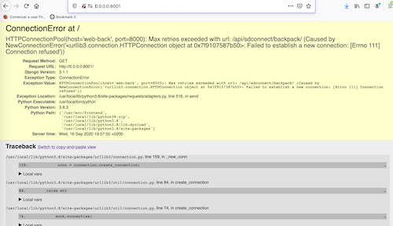
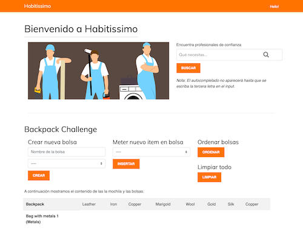

ACERCA DEL PROYECTO
========

Se trata de una aplicación desarrollada con Python, Django, HTML, CSS, JQUERY Y AJAX. Es una API REST que consta de 2 partes, un frontend que hace peticiones a la API que está en el backend.

La instalación del proyecto es muy simple:

1. Instalar Docker en tu ordenador.

2. Clonar el repositorio de GitHub en la carpeta de tu ordenador que quieras con el comando:
```
$ git clone https://github.com/hugosalas91/habitissimo.git
```

3. Desplegar los contenedores docker con la siguiente instrucción:
```
$ docker-compose up -d --build
```

4. Cuando terminen de instalar los contenedores esperar unos 20 segundos a que la aplicación este lista. Si aún no está lista aparecerá el siguiente error:



Para acceder a la web vamos a la URL **http://0.0.0.0:8001/**.

Así debería verse la Home:



En el cuadro de búsqueda podremos buscar cosas relacionadas con pintores o fontaneros, para que aparezcan las búsquedas sugeridas lo tengo configurado a mínimo 3 letras escritas en el cuadro.

Abajo está el desafío de la mochila y podeis jugar con los formularios.

Si quereis también podeis entrar en el panel de administración de la aplicación en la URL **http://0.0.0.0:8000/** con el usuario **habitissimo** y la contraseña **testpass123**.
